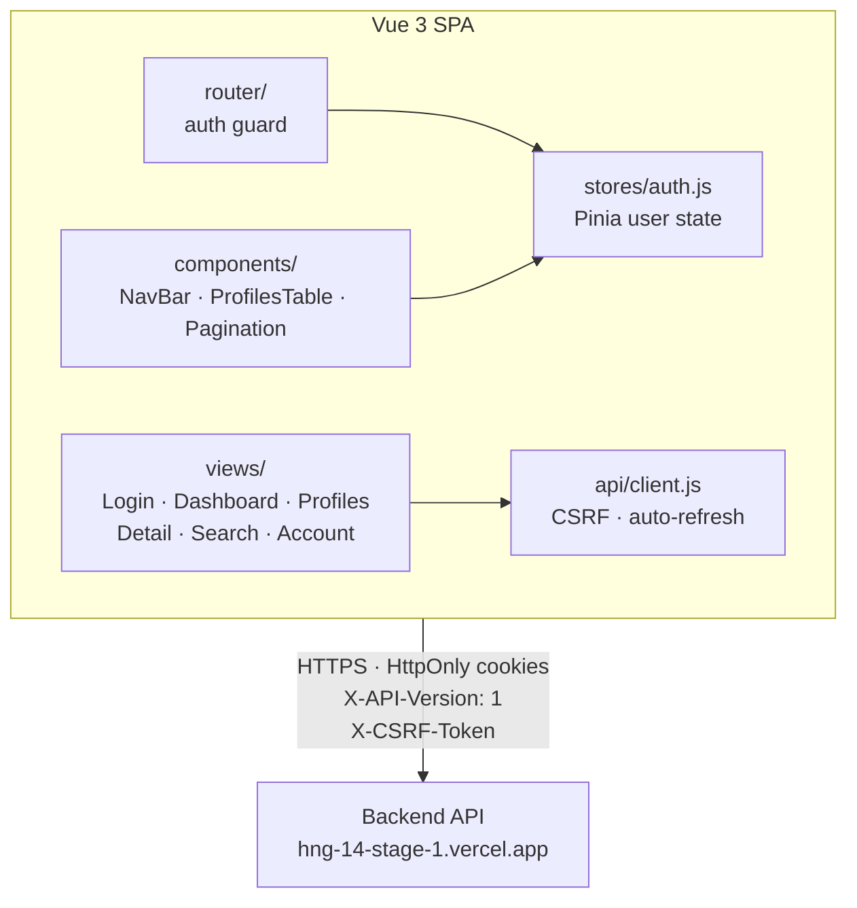
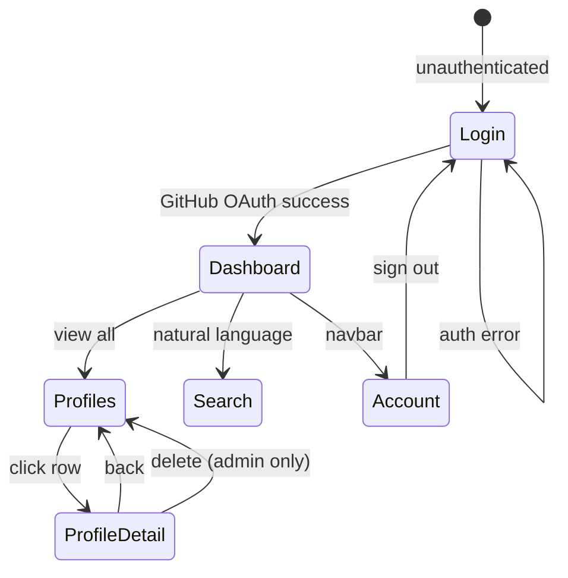
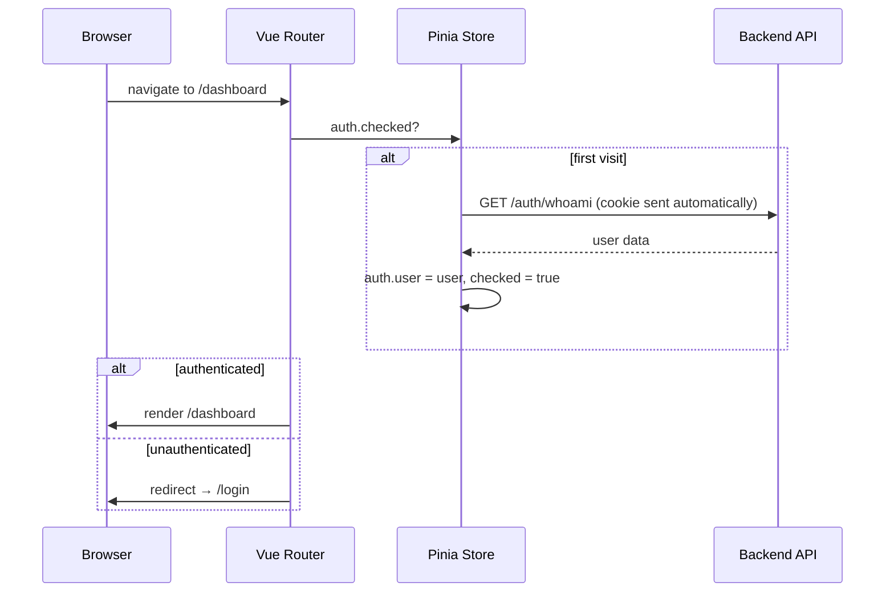

# Insighta Labs+ — Web Portal

Browser-based interface for the Insighta Labs+ profile intelligence platform. Built with Vue 3, Vite, and Tailwind CSS. Deployed on Vercel.

**Live portal:** https://hng-14-web-portal.vercel.app

---

## System Architecture



### Page Navigation Flow



---

## Authentication Flow

### Login

```
Browser                          Backend                    GitHub
   │                                │                          │
   │── click "Continue with GitHub" │                          │
   │── GET /auth/github ────────────►                          │
   │◄── 302 → GitHub OAuth page ────│                          │
   │                                │                          │
   │── user authenticates ──────────────────────────────────►│
   │◄── redirect /auth/github/callback?code= ────────────────│
   │                                │                          │
   │                                │  exchange code           │
   │                                │  fetch user info         │
   │                                │  upsert user in DB       │
   │                                │  issue JWT pair          │
   │◄── 302 → /dashboard ───────────│                          │
   │    Set-Cookie: access_token  (HttpOnly; Secure; SameSite=None) │
   │    Set-Cookie: refresh_token (HttpOnly; Secure; SameSite=None) │
   │    Set-Cookie: csrf_token    (Secure; JS-readable)        │
```

Tokens are stored in `HttpOnly` cookies — they are never accessible to JavaScript, protecting against XSS.

### Session Check (route guard)

On every navigation the Vue Router guard calls `GET /auth/whoami` once (cached in Pinia via `auth.checked`). Unauthenticated users are redirected to `/login`.



### CSRF Protection

For all mutating requests (`POST`, `PUT`, `DELETE`, `PATCH`), the client reads the `csrf_token` cookie and sends it as the `X-CSRF-Token` request header. Because the cookie is readable by JavaScript but the header can only be set by the same origin, this prevents cross-site request forgery.

### Token Refresh

When any API call returns `401`:
1. The client transparently calls `POST /auth/refresh` (cookies sent automatically)
2. If refresh succeeds → backend sets new cookies; client retries original request
3. If refresh fails → user is redirected to `/login?error=session_expired`

Only one refresh attempt runs at a time (concurrent 401s share the same promise).

---

## Token Handling

| Token | Expiry | Storage | JS accessible |
|---|---|---|---|
| Access token | 3 minutes | `HttpOnly` cookie | No |
| Refresh token | 5 minutes | `HttpOnly` cookie | No |
| CSRF token | 3 minutes | Regular cookie | Yes (read-only) |

Tokens are rotated on every refresh — the old refresh token is revoked server-side immediately.

---

## Role Enforcement

The portal reflects server-side role enforcement:

- **Admin** users see a "Delete profile" button on profile detail pages.
- **Analyst** users have read-only access; delete actions return `403` from the API.
- The `NavBar` and `AccountView` display the user's current role badge.
- All enforcement is authoritative at the API level; the UI only adjusts presentation.

---

## Pages

| Route | Description | Access |
|---|---|---|
| `/login` | GitHub OAuth entry point | Public |
| `/dashboard` | Stats overview + recent profiles | Auth required |
| `/profiles` | Filterable, paginated profile list + CSV export | Auth required |
| `/profiles/:id` | Profile detail + admin delete | Auth required |
| `/search` | Natural language search | Auth required |
| `/account` | User info + sign out | Auth required |

Unknown routes redirect to `/dashboard`.

---

## Pages Detail

### Dashboard
Displays total profiles, male/female split, and adult count derived from live API data. Shows age group distribution as a proportional bar chart and a table of the 5 most recent profiles.

### Profiles
Filter by gender, age group, country code, and sort field. Results are paginated (20 per page). Clicking a row navigates to the profile detail view. The **Export CSV** button downloads a filtered CSV of all matching profiles.

### Search
Free-text natural language search powered by the backend NLP parser. Supports queries like:
- `young males from Nigeria`
- `adult women in Germany`
- `seniors above 60`

Page resets to 1 on each new search submission.

### Profile Detail
Displays all profile fields with confidence percentages. Admin users see a **Delete profile** button; errors from failed deletes are surfaced inline.

### Account
Shows avatar, username, email, role, and permissions. Includes a Sign out button that revokes the server-side session and clears cookies.

---

## Local Development

```bash
git clone https://github.com/NgBlaze/hng_14_web_portal.git
cd hng_14_web_portal
npm install
cp .env.example .env.local   # set VITE_API_URL if needed
npm run dev
# → http://localhost:5173
```

### Environment Variables

| Variable | Default | Description |
|---|---|---|
| `VITE_API_URL` | `https://hng-14-stage-1.vercel.app` | Backend API base URL |

---

## Deployment

Deployed on Vercel as a static SPA. `vercel.json` rewrites all paths to `index.html` so Vue Router handles client-side navigation.

```bash
npm run build
vercel --prod
```

### CI/CD

GitHub Actions runs on every PR to `main`:
- `npm run build` — verifies the Vite build succeeds

See `.github/workflows/ci.yml`.
